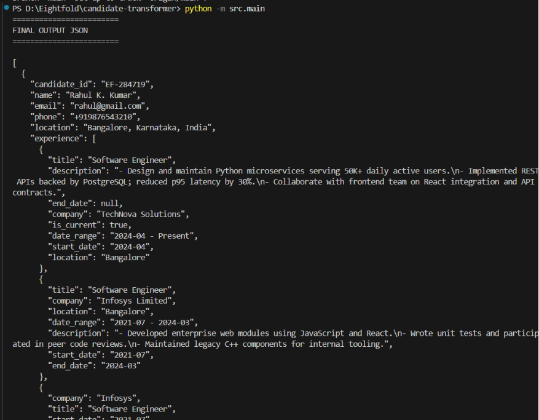

# Multi-Source Candidate Data Transformer

A Python-based candidate data transformation pipeline built for the Eightfold Engineering Internship Assignment.

The project ingests candidate information from multiple heterogeneous sources, normalizes inconsistent data, detects duplicate candidates, resolves conflicting values, tracks provenance and confidence, and generates a configurable canonical candidate profile in JSON format.

---

# Features

- Supports multiple data sources
  - Structured ATS JSON
  - Unstructured Resume PDF
  - GitHub Public REST API (Optional)

- Rule-based deterministic parsing

- Data normalization
  - Email normalization
  - Phone number normalization (E.164)
  - Skill canonicalization
  - Name normalization
  - Date normalization

- Duplicate candidate detection

- Conflict resolution

- Confidence scoring

- Provenance tracking

- Configurable output projection

- Command Line Interface (CLI)

- Minimal Gradio Web UI

---

# Project Structure

```
candidate-transformer/
│
├── config/
│   └── output_config.json
│
├── images/
│   └── final-output.png
│
├── inputs/
│   ├── ats.json
│   └── resume.pdf
│
├── output/
│   └── final_candidate.json
│
├── src/
│   ├── parser.py
│   ├── normalizer.py
│   ├── merger.py
│   ├── confidence.py
│   ├── projector.py
│   ├── schema.py
│   ├── utils.py
│   └── main.py
│
├── tests/
│
├── app.py
├── requirements.txt
├── README.md
└── .gitignore
```

---

# Pipeline

```
ATS JSON
        │
Resume PDF
        │
GitHub API (Optional)
        │
        ▼
      Parser
        ▼
   Normalizer
        ▼
Duplicate Detection
        ▼
 Conflict Resolution
        ▼
 Confidence Scoring
        ▼
 Provenance Tracking
        ▼
 Output Projection
        ▼
 Canonical Candidate JSON
```

---

# Technologies Used

- Python 3.x
- Gradio
- pdfplumber
- Requests
- JSON
- Regular Expressions (re)
- argparse
- pathlib
- dataclasses

---

# Installation

Clone the repository

```bash
git clone https://github.com/Divyasri-m18/candidate-transformer.git
```

Move into the project

```bash
cd candidate-transformer
```

Create virtual environment

```bash
python -m venv .venv
```

Activate virtual environment

Windows

```bash
.venv\Scripts\activate
```

Linux / macOS

```bash
source .venv/bin/activate
```

Install dependencies

```bash
pip install -r requirements.txt
```

---

# Running the CLI

Run the complete transformation pipeline

```bash
python -m src.main
```

Show help

```bash
python -m src.main --help
```

Using GitHub API

```bash
python -m src.main --github Divyasri-m18
```

---

# Running the Gradio UI

Start the web application

```bash
python app.py
```

Open the local URL displayed in the terminal (typically):

```
http://127.0.0.1:7860
```

Upload:

- ATS JSON
- Resume PDF
- Optional GitHub Username

Click **Transform Candidate** to generate the canonical candidate profile.

---

# Data Sources

## Structured Source

- ATS JSON

## Unstructured Sources

- Resume PDF
- GitHub Public REST API

---

# Normalization

The project uses a deterministic rule-based normalization approach.

Implemented normalizations include:

- Email → Lowercase
- Phone → E.164 format
- Skills → Canonical mapping
- Names → Trim + Title Case
- Dates → YYYY-MM

---

# Duplicate Detection Strategy

Candidate records are matched using deterministic priority:

1. Email
2. Phone Number
3. Normalized Full Name (Fallback)

---

# Conflict Resolution

When multiple sources contain different values:

Priority:

```
Resume
    ↓
ATS
    ↓
GitHub
```

The highest priority value is selected while preserving provenance and confidence information.

---

# Confidence Scoring

Confidence is assigned based on source reliability.

Example

| Source | Confidence |
|---------|-----------:|
| ATS JSON | 0.95 |
| Resume PDF | 0.85 |
| GitHub | 0.75 |

---

# Output

The pipeline generates a canonical JSON profile.

Example output

```
output/
    final_candidate.json
```

---

# Screenshots

## Final Output

The screenshot below shows the successful execution of the candidate transformation pipeline.



---

# Future Improvements

- LinkedIn API Integration
- Additional ATS Connectors
- Batch Processing
- REST API Service
- Docker Support
- Database Persistence

---

# Assignment Requirements Covered

- Structured Source
- Unstructured Source
- Multi-source Parsing
- Data Normalization
- Duplicate Detection
- Conflict Resolution
- Confidence Scoring
- Provenance Tracking
- Configurable Projection
- CLI
- Minimal UI

---

# Author

**Divyasri M**

GitHub

https://github.com/Divyasri-m18

---

# License

This project was developed as part of the Eightfold Engineering Internship Assignment.
